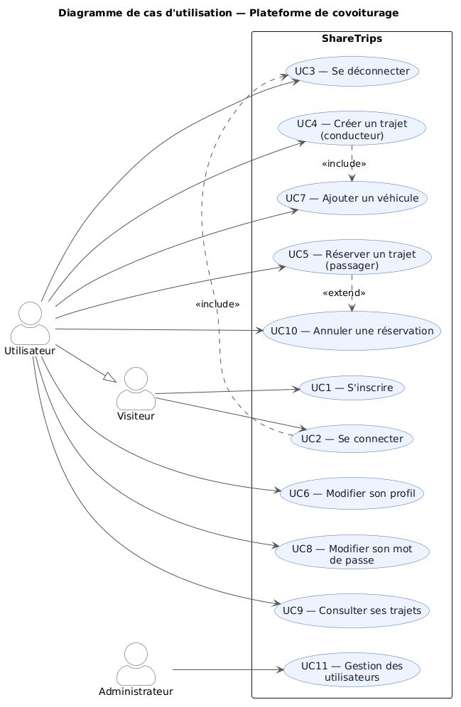
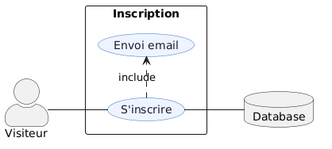
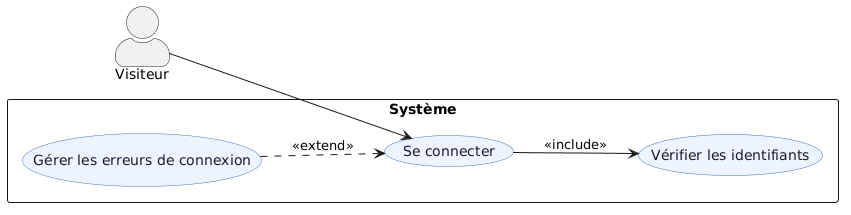
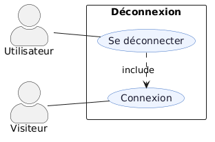
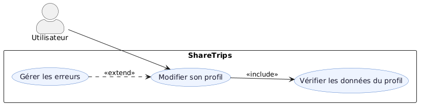
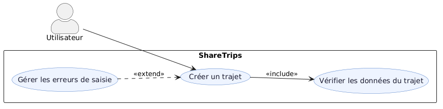
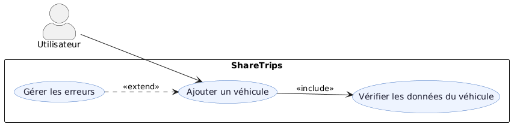
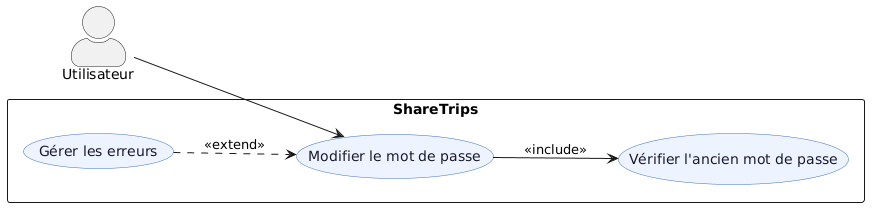
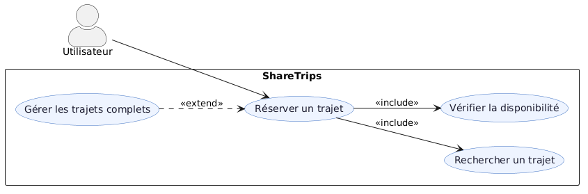
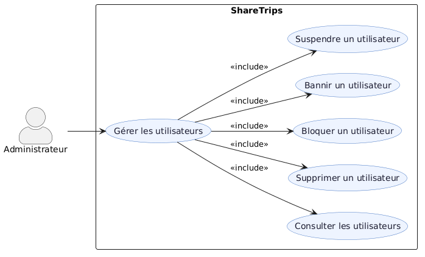

# Cas d'utilisation
[Retour à la documentation](index.md)

## Acteurs
* **Visiteur** : utilisateur non connecté
* **Utilisateur** : utilisateur authentifié
* **Système** : application ShareTrips

* [Liste des cas d'utilisation](#liste-des-cas-dutilisation)
    * [Inscription](#inscription)
    * [Authentification](#authentification)
    * [Déconnexion](#deconnexion)
    * [Modifier son profil](#modifier-son-profil)
    * [Publier un trajet](#publier-un-traje)
    * [Ajouter un véhicule](#ajouter-un-véhicule)
    * [Modifier son mot de passe](#modifier-son-mot-de-passe)
    * [Réserver un trajet](#réserver-un-trajet)
    * [Gestion des utilisateurs](#gestion-des-utiliateurs)

### Liste des cas d'utilisation

#### Inscription

#### Authentification

#### Déconnexion

#### Modifier son profil

#### Publier un trajet

#### Ajouter un véhicule

#### Modifier son mot de passe

#### Réserver un trajet

#### Gestion des utilisateurs
